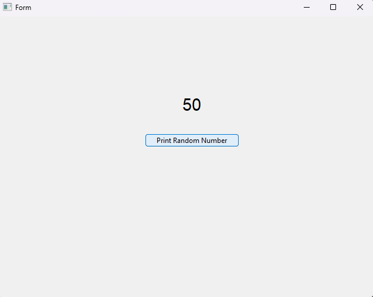

# Welcome Friday people

Things to do this meeting

- Install PythonQT Designer
- Learn about branches in git
- Add a button to the menu
- Change Button Text

- CHALLENGE: Add a "Label" to the UI in QT Designer and make the button generate a random number from 1 - 100 and have it display in the Label

- While challenge is going I will help people install the things that they need 👍